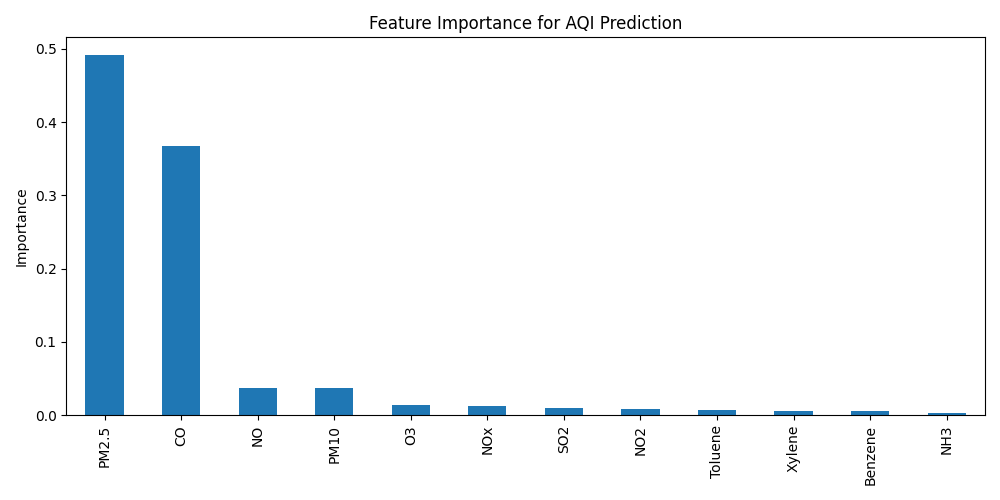

# 🌍 Air Quality Predictor (SmartScape Hackathon 2026)

## Track: Ecology & Urban Environment

## Problem
Air pollution is a critical issue for cities. Residents often have no easy way to understand current air quality risks or how different pollutants contribute to overall AQI (Air Quality Index).

## Solution
An AI-powered web app that predicts AQI based on pollutant levels (PM2.5, PM10, NO, NO2, CO, SO2, O3, etc.) using a Machine Learning model trained on real city air quality data. Users can input pollutant levels and instantly get a health recommendation.

## Technology
- **Python, scikit-learn** — Random Forest Regressor (R² = 0.91)
- **Pandas** — data cleaning and preprocessing
- **Streamlit** — interactive web interface
- **Matplotlib** — feature importance visualization

## How it works
1. Model trained on real Indian city air quality dataset (29,000+ records)
2. Predicts AQI from 12 pollutant features
3. Feature importance analysis shows PM2.5 and CO are the strongest predictors of AQI
4. Web app gives real-time predictions and health warnings (Good / Moderate / Unhealthy / Dangerous)

## How to run
1. Open `Untitled0.ipynb` in Google Colab
2. Run all cells — this downloads data, trains the model, and saves `aqi_model.pkl`
3. Run the Streamlit app:
## Future plans
- Integrate live sensor/satellite data for real-time monitoring
- Expand to multiple cities and regions
- Add map-based visualization of pollution hotspots
- Connect with city alert systems for high-pollution warnings

## Feature Importance

 ты мне это еще скинул. Это нужно?
